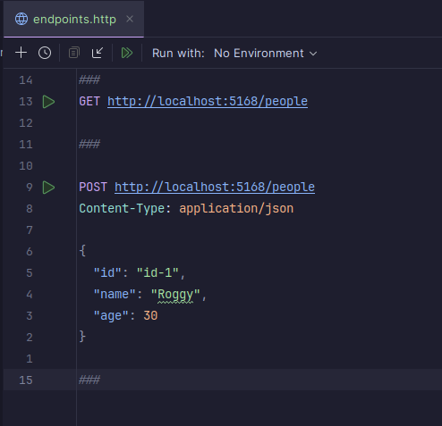

# F# MINIMAL API with MONGO DB

This is a minimal API using F# and MongoDB.

1 - Install the dotnet sdk: https://dotnet.microsoft.com/download

2 - Run docker-compose up -d, this will start a mongo db instance

3 - Run dotnet run, this will start the API

4 - There is a HTTP Request file in the root of the project, you can use it to test the API

